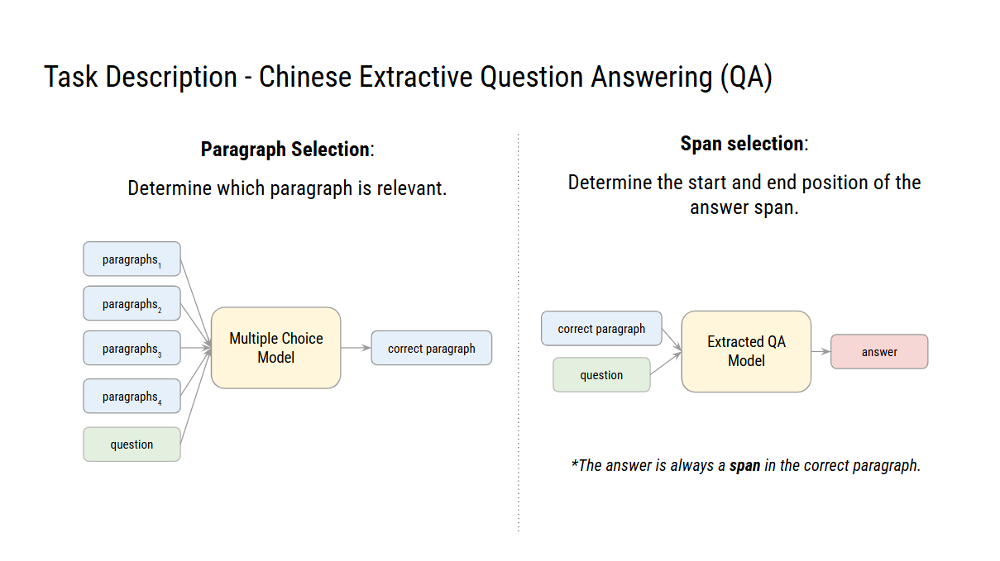

# ADL 2024 HW1 README

## Description



從四個段落中選擇一個跟問題最相關的段落，並從該段落中選擇一段文字作為答案。

- Paragraph Selection (on validation set): 0.967
- Span Selection (on validation set): 0.825
- End-to-End (on validation set): 0.399
- Kaggle Score: 0.787 / X

## Install

```bash
poetry install

poetry shell
```

## File Structure

`endtoend.py`: End-to-End 模型
`plot.py`: 繪製圖表
`predict.py`: 預測答案
`selection.py`: 段落選擇模型
`span.py`: 答案選擇模型
`utils_qa.py`: 輔助函數

```bashs
├─ data
│  ├─ context.json
│  ├─ test.json
│  ├─ train.json
│  └─ valid.json
├─ download.sh
├─ endtoend.py
├─ plot.py
├─ predict.py
├─ README.md
├─ run.sh
├─ selection.py
├─ span.py
└─ utils_qa.py
```

## Paragraph Selection

```bash
python ./selection.py --max_seq_length 512 --pad_to_max_length --context_file ./data/context.json --train_file ./data/train.json --validation_file ./data/valid.json --model_name_or_path hfl/chinese-macbert-base --gradient_accumulation_steps 32 --per_device_train_batch_size 2 --per_device_eval_batch_size 2 --learning_rate 5e-5  --num_train_epochs 1 --lr_scheduler_type cosine --output_dir ./output/select/1 --seed 42
```

## Span Selection

```bash
python ./span.py --max_seq_length 512 --pad_to_max_length --context_file ./data/context.json --train_file ./data/train.json --validation_file ./data/valid.json --model_name_or_path hfl/chinese-macbert-base --per_device_train_batch_size 8 --per_device_eval_batch_size 8 --gradient_accumulation_steps 4 --learning_rate 5e-5 --num_train_epochs 3 --lr_scheduler_type cosine --output_dir ./output/span/1 --seed 42 --max_answer_length 40 --n_best_size 40
```

## Predict

```bash
python ./predict.py --output_file ./output/predict/1/predictions.csv     --context_file ./data/context.json --test_file ./data/test.json --max_seq_length 512 --pad_to_max_length --selection_model_name_or_path ./output/select/1 --extra_model_name_or_path ./output/span/1 --max_answer_length 40 --n_best_size 40
```

## End-to-End

```bash
python ./endtoend.py --max_seq_length 512 --context_file ./data/context.json --train_file ./data/train.json --validation_file ./data/valid.json --pad_to_max_length --model_name_or_path xlnet/xlnet-base-cased --per_device_train_batch_size 2 --per_device_eval_batch_size 2 --gradient_accumulation_steps 32 --learning_rate 3e-5 --num_train_epochs 2 --lr_scheduler_type cosine --output_dir ./output/end/1 --seed 42
```

## Plot

```bash
python ./plot.py --max_seq_length 512 --pad_to_max_length --context_file ./data/context.json --train_file ./data/train.json --validation_file ./data/valid.json --model_name_or_path hfl/chinese-macbert-base --per_device_train_batch_size 8 --per_device_eval_batch_size 8 --gradient_accumulation_steps 4 --learning_rate 5e-5 --num_train_epochs 1 --lr_scheduler_type cosine --output_dir ./output/plot/1 --seed 42 --max_answer_length 40 --n_best_size 40
```

## From Scratch Selection

```bash
python ./selection.py --max_seq_length 512 --pad_to_max_length --context_file ./data/context.json --train_file ./data/train.json --validation_file ./data/valid.json --model_type bert --tokenizer_name hfl/chinese-macbert-base --gradient_accumulation_steps 16 --per_device_train_batch_size 2 --per_device_eval_batch_size 2 --learning_rate 5e-5 --num_train_epochs 1 --lr_scheduler_type cosine --output_dir ./output/select/100 --seed 42
```

## Use Script

```bash
./dwonload.sh

./run.sh ./data/context.json ./data/test.json ./prediction.csv
```
