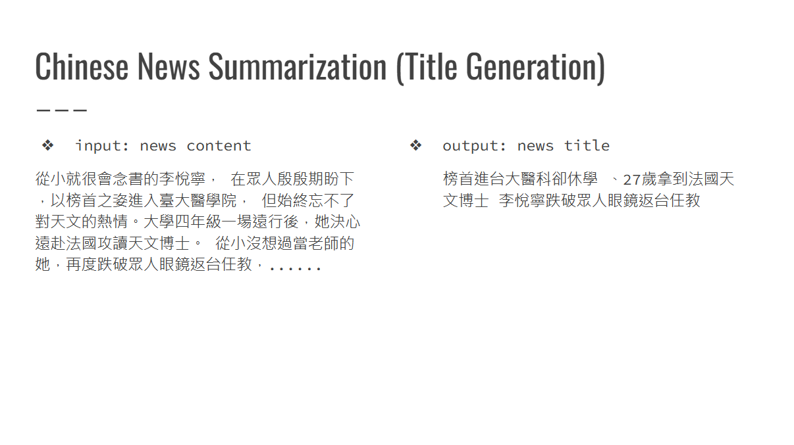

# ADL 2024 HW2 README

## Description



從給定的新聞文章中提取標題。

## Install

如果要使用 `spacy` 這個套件，需要安裝 [Microsoft C++ Build Tools](https://visualstudio.microsoft.com/zh-hant/visual-cpp-build-tools/) 來編譯 `spacy` 的依賴套件。

```bash
pyenv install 3.8.10
pyenv local 3.8.10

poetry env use 3.8.10
poetry install
poetry shell
```

## File Structure

- `data/`: 存放資料集
- `output/`: 存放模型
- `predict/`: 存放預測結果
- `summary.py`: 訓練模型
- `predict.py`: 預測結果
- `eval.py`: 評估預測結果
- `plot.py`: 繪製學習曲線

## Train

```bash
python ./summary.py --train_file ./data/train.jsonl --model_name_or_path google/mt5-small --output_dir ./output/1 --text_column maintext --summary_column title --lr_scheduler_type cosine --max_source_length 512 --max_target_length 64 --pad_to_max_length --learning_rate 1e-4 --num_train_epochs 10 --per_device_train_batch_size 4 --per_device_eval_batch_size 8 --gradient_accumulation_steps 2 --num_beams 20 --source_prefix summarize: 
```

## Predict

```bash
python ./predict.py --test_file ./data/public.jsonl --model_name_or_path ./output/1 --text_column maintext --summary_column title --max_source_length 512 --max_target_length 64 --pad_to_max_length --per_device_test_batch_size 4 --strategy beam_search --num_beams 20 --output_file ./predict/1.jsonl
```

## Eval

```bash
python ./eval.py -r ./data/public.jsonl -s ./predict/1.jsonl
```

## Plot

```bash
python ./plot.py --input_dir ./predict/1 --output_dir ./predict/1
```
