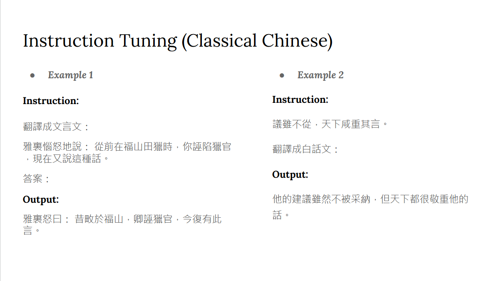

# ADL 2024 HW3 README

## Description



將文言文跟中文互相翻譯

## Install

```bash
pyenv install 3.10.11
pyenv local 3.10.11

poetry env use 3.10.11
poetry install
```

## File Structure

- `data/`: 存放資料集
- `output/`: 存放模型
- `predict/`: 存放預測結果
- `summary.py`: 訓練模型
- `predict.py`: 預測結果
- `eval.py`: 評估預測結果
- `plot.py`: 繪製學習曲線
